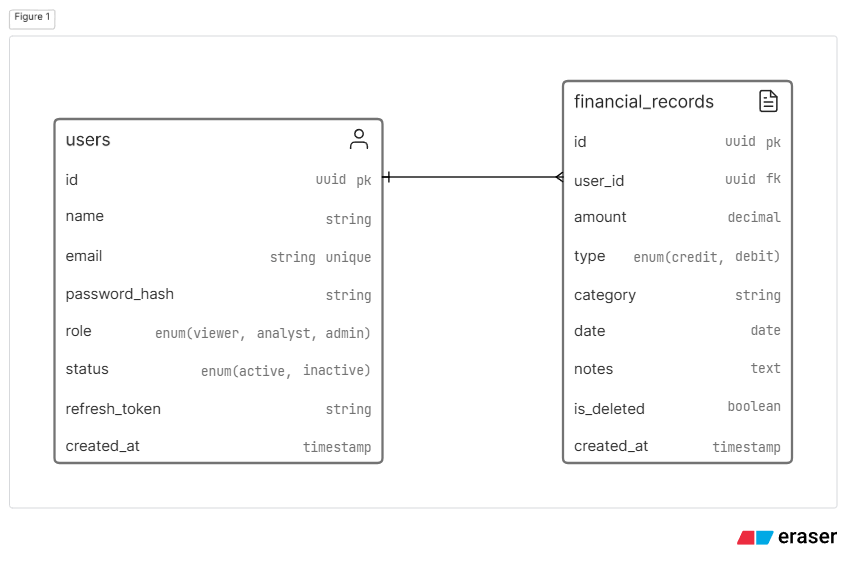

# Finance Backend

A lightweight finance data API that handles user auth, role-based access control, and CRUD-style record management. Built for clarity and evaluation: clean responses, strict validation, and a small, understandable surface area.

## Project Overview

This service exposes REST endpoints for:

- Authentication (register, login, refresh, logout)
- Financial record creation and querying
- Admin-only user management (roles and activation status)
- A dashboard summary endpoint for totals and recent activity

## Tech Stack

- Node.js + TypeScript
- Express 5
- Prisma ORM
- SQLite (local dev)
- Zod for validation
- JWT for auth (access + refresh)

## Setup Instructions

1. Install dependencies:
   ```bash
   npm install
   ```
2. Create a `.env` file in the project root:
   ```bash
   ACCESS_TOKEN_SECRET=your_access_secret
   REFRESH_TOKEN_SECRET=your_refresh_secret
   ACCESS_TOKEN_EXPIRY=15m
   REFRESH_TOKEN_EXPIRY=7d
   PORT=8000
   ```
3. (Optional) If you want a fresh local DB, reset migrations and recreate:
   ```bash
   npx prisma migrate reset
   ```
4. Run the app in dev mode:
   ```bash
   npm run dev
   ```

The API will be available at `http://localhost:8000/api/v1`.

## API Endpoints

Base path: `/api/v1`

Full API reference: [docs/api.md](docs/api.md)

### Auth

- `POST /auth/register`
- `POST /auth/login`
- `POST /auth/refresh-token`
- `POST /auth/logout`

### Records

- `POST /records` (admin)
- `GET /records` (admin, analyst, viewer)
- `PUT /records/:id` (admin)
- `DELETE /records/:id` (admin)

### Dashboard

- `GET /dashboard/summary` (any authenticated user)

## Database Schema



[View on Eraser](https://app.eraser.io/workspace/DuA2UOiL6N0adJBWxPHs?figure=sqFJVQ4-g_vkpWsVN_xry)

```prisma
model User {
   id           String   @id @default(uuid())
   name         String
   email        String   @unique
   passwordHash String
   role         Role     @default(viewer)
   status       Status   @default(active)
   refreshToken String?
   createdAt    DateTime @default(now())

   records FinancialRecord[]
}

model FinancialRecord {
   id        String          @id @default(uuid())
   userId    String // Foreign key to User
   amount    Float
   type      TransactionType
   category  String
   date      DateTime
   notes     String?
   isDeleted Boolean         @default(false)
   createdAt DateTime        @default(now())

   user User @relation(fields: [userId], references: [id])
}

enum Role {
   viewer
   analyst
   admin
}

enum Status {
   active
   inactive
}

enum TransactionType {
   credit
   debit
}
```

### Users (admin only)

- `GET /users`
- `GET /users/:id`
- `PATCH /users/:id/role`
- `PATCH /users/:id/status`

## Assumptions Made

- Local development uses SQLite with the file-backed DB (`dev.db`) at repo root.
- Access and refresh token secrets are provided via `.env`.
- Only admins can manage user roles and status, and admins cannot update their own role/status.
- Financial records are soft-deleted via `isDeleted`.

## Role Permissions

The table below mirrors how the routes are wired. Wording is intentionally plain to match how this was discussed during implementation.

| Capability                   | Viewer | Analyst | Admin |
| ---------------------------- | ------ | ------- | ----- |
| View records list            | yes    | yes     | yes   |
| Create records               | no     | no      | yes   |
| Update records               | no     | no      | yes   |
| Delete records               | no     | no      | yes   |
| View dashboard summary       | yes    | yes     | yes   |
| List users / view user       | no     | no      | yes   |
| Change user role             | no     | no      | yes   |
| Activate or deactivate users | no     | no      | yes   |

Notes:

- Any request that requires a role also requires a valid access token.
- An admin cannot change their own role or status to prevent lockouts.
